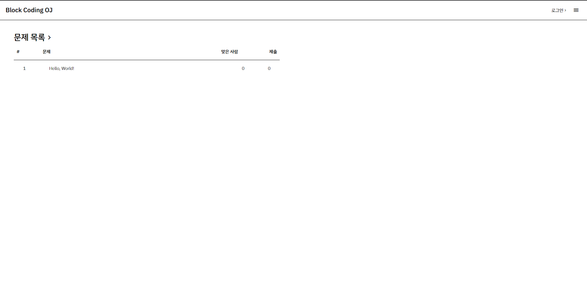
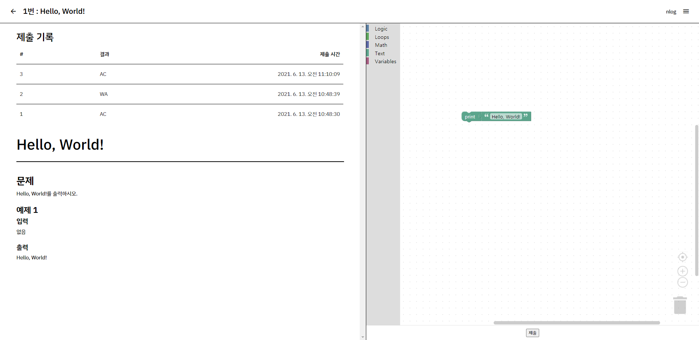

# 블럭코딩 온라인 저지
* 블럭코딩을 사용한 온라인 저지
* 2021학년도 응용프로그래밍 수행평가 제출

## 스크린샷

## 레퍼런스
* https://codingcompetitions.withgoogle.com/codejam
* https://developers.google.com/blockly

## TODO
* ~~아마 계속 개발하게 된다면 해야할 것들~~
- [ ] [ioi/isolate](https://github.com/ioi/isolate)을 사용하여 격리된 채점 서버 구현
- [ ] 채점 큐 구현 및 로드밸런싱 처리
- [ ] 프론트엔드 디자인 수정
- [ ] 입력을 위한 Blockly Custom Block 추가
- [ ] 제출 현황 열람 등 미비하거나 없는 기능 추가
- [ ] ~~SPJ 추가?~~